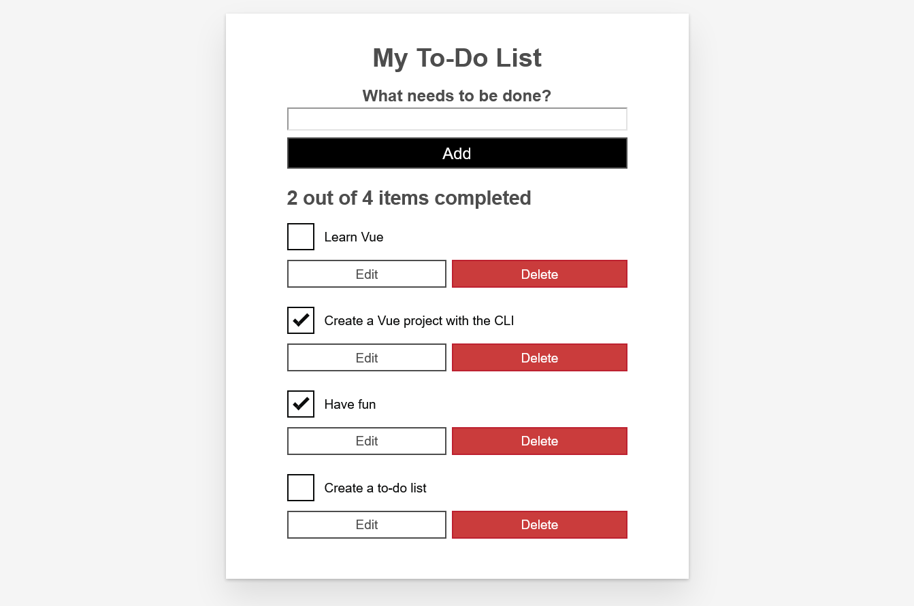

# MDN To-Do list tutorial using Vue

This is my result of following steps in [the tutorial by MDN](https://developer.mozilla.org/en-US/docs/Learn/Tools_and_testing/Client-side_JavaScript_frameworks/Vue_getting_started) of getting accustomed with Vue.js framework.

## Screenshot

